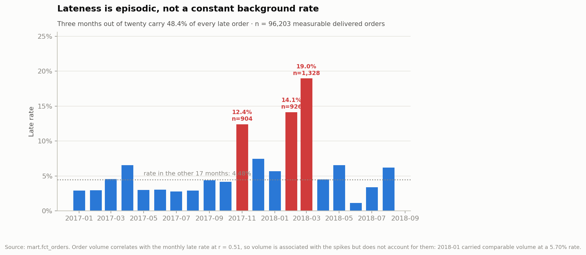
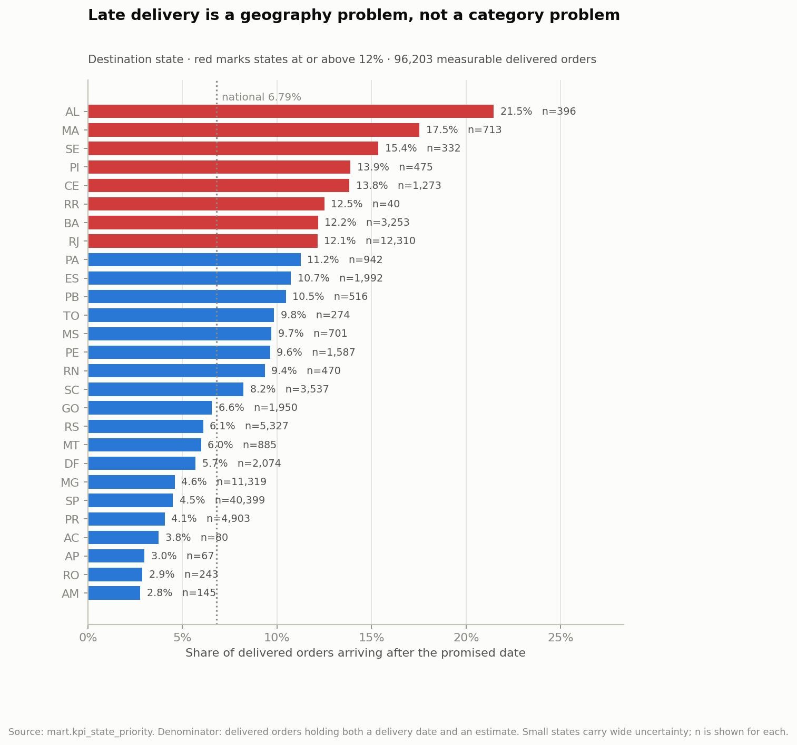

# Olist — Sales, Delivery Performance and Customer Satisfaction

[](https://github.com/leles/olist-analysis/actions/workflows/tests.yml)

Reproducible analysis of the Olist Brazilian e-commerce dataset (~100k orders,
2016–2018), covering item revenue over time, delivery delays by category and
region, and the relationship between lateness and review scores.

**Stack**: DuckDB + SQL · Python/pandas · pytest · Power BI (and a
browser-viewable HTML/matplotlib alternative).

127 tests. The 31 that need no licensed data run in CI on every push, building
the full SQL model from a synthetic fixture.

**[Read the findings →](reports/report.md)** · **[Interactive charts →](https://leles.github.io/olist-analysis/)**
*(replace that link with your own Pages URL after enabling GitHub Pages on the `docs/` folder)*



Three months out of twenty carry **48.4% of every late delivery**. The orders
customers rated *worst*, meanwhile, were **six times less likely to be late** than
the average order — so delivery speed explains only part of dissatisfaction.



> Status: all five milestones complete. The Power BI `.pbix` is the one deliverable
> not in the repository — Power BI Desktop was not installed on the development
> machine, so `dashboard/POWERBI_BUILD.md` is a build sheet rather than a record of
> something already built.

---

## Business questions

1. How does the value of sold items evolve over time?
2. Which product categories and geographic areas concentrate delivery delays?
3. How do review scores differ between on-time and late orders?
4. Which issues deserve attention once both rate **and** volume are considered?

## Repository layout

```
data/          provenance and licence notes (raw data is NOT versioned)
src/           ingest, build and export scripts
sql/           00_staging -> 10_quality -> 20_intermediate -> 30_marts -> 40_kpi
notebooks/     exploratory analysis
tests/         grain, KPI reconciliation, report figures, and a synthetic-data
               pipeline suite that runs in CI without the licensed dataset
dashboard/     exports/ (reconciled CSV aggregates), olist_charts.html, Power BI build spec
docs/          GitHub Pages build of the interactive page (plotly from CDN, ~37 KB)
reports/       data dictionary, quality report, figures, final report
```

## Reproduction

```bash
# 1. Dependencies
python -m pip install -r requirements.txt

# 2. Data (see data/README.md for the manual alternative)
python src/ingest.py --download

# 3. Build the modelled layers (staging -> quality -> intermediate -> marts -> KPI)
python src/build.py

# 4. Tests
python -m pytest -q

# 5. Regenerate the generated documents
python src/profile_columns.py   # reports/data_dictionary.md
python src/quality_report.py    # reports/quality_report.md

# 6. Dashboard-ready aggregates, each reconciled against its source view
python src/export_bi.py

# 7. Figures, the standalone page, and the GitHub Pages build
python src/make_charts.py
```

A from-scratch rebuild is **byte-reproducible**: delete `data/olist.duckdb`, run
the steps above, and every generated file — CSVs, figures, HTML, data dictionary,
quality report — comes back identical. Verified, not assumed.

`tests/test_report_figures.py` pins every headline number quoted in
`reports/report.md`, so the report cannot silently drift away from the data: if
one changes without the other, the suite fails.

The DuckDB database lands at `data/olist.duckdb` and is rebuilt from scratch by
step 2; nothing downstream depends on manual state.

## Analytical conventions

These are the rules the whole project is held to:

- **Grain is declared for every table.** Orders, items, payments and reviews
  live at different grains; they are aggregated separately and joined only at
  one-row-per-order grain, so amounts are never multiplied by a join.
- **`customer_id` ≠ `customer_unique_id`.** The first is per-order, the second
  is the person. Customer counts use the second; joins use the first.
- **Item value, freight and payments are three different measures.** None of
  them is profit, and the project never calls them that.
- **Every KPI states its filter and its denominator**, including how
  cancellations, missing timestamps and duplicate reviews are handled, and how
  many rows each rule removed.
- **Every comparison reports its group sizes.**
- **Associations are not causes.** Late deliveries correlating with low review
  scores is reported as an association.
- **A review of a multi-seller order is not attributed to one seller.**

- **Rates carry confidence intervals.** 95% Wilson score, so a 21.5% rate on 396
  orders is not read like a 4.5% rate on 40,399. Six of 27 states turn out not to
  be distinguishable from the national rate at all.
- **Cohorts are measured over a fixed window and censoring is flagged**, not
  hidden by a trailing decline that is really an artefact of observation time.

Four of these rules caught real errors during development, each recorded in the
commit history rather than quietly fixed: a `review_id` primary key that was not
unique, a benchmark hardcoded at one denominator and drawn against another, a
"within 1.3 points" claim about category spread that was false in the favourable
direction, and a dismissal of one category as small-sample noise that the
confidence interval contradicted.

## AI usage

This project was developed with Claude Code as a pair-programming assistant.
Claude scaffolded the repository, drafted SQL and Python, and proposed the KPI
definitions; every figure quoted in `reports/` comes from a query that was
actually executed against the local database, not from the assistant's prior
knowledge of the dataset. Model Context Protocol (MCP) servers were used as
follows:

| MCP server | Status in this project |
|---|---|
| IDE (`executeCode`) | **Available but not used.** It requires an open notebook editor in VS Code; the session ran from a terminal, so the call returned `No active notebook editor found`. The notebook was instead generated and executed headlessly with `nbclient`, which stores real outputs in `notebooks/01_eda.ipynb`. Opening that notebook in VS Code makes this MCP server usable for live kernel work. |
| IDE (`getDiagnostics`) | Available; same editor requirement. |
| Claude Docs | Available; the report is written as a Markdown file in `reports/` instead. |

**There is no MCP server for DuckDB, Power BI or Kaggle.** Those are driven by
the scripts in `src/`: `duckdb` as a Python library, the Kaggle API client for
the download, and Power BI opened by hand against `dashboard/exports/`.

This table lists what was actually used rather than what would sound good. A
tool that was available but did not run is recorded as not used.

## Continuous integration

The dataset is licensed CC BY-NC-SA and cannot be committed, so CI cannot run the
Olist-specific assertions — they skip by design when `data/olist.duckdb` is
absent. What CI *does* run is the entire SQL pipeline against
[`tests/synthetic.py`](tests/synthetic.py), a small fabricated fixture that
deliberately reproduces every defect shape in the real source: a multi-seller
order, a doubly-reviewed order, a `review_id` shared across orders, a split
payment, a cancelled order with no items, a delivered order with no delivery
date, and a zip prefix with a leading zero.

That suite asserts grain, money conservation and the handling of each defect, so
a regression in the pipeline fails the build even though the real data is
nowhere near it. The workflow also fails if any dataset file is ever tracked in
git.

## Licence

Code: MIT, see [`LICENSE`](LICENSE). The dataset is published by Olist under
CC BY-NC-SA 4.0 and is **not redistributed here** — no raw records are versioned.
The aggregates under `dashboard/exports/` are derived group-level summaries and
remain subject to the dataset's own terms, including its non-commercial
restriction. See [`data/README.md`](data/README.md).
