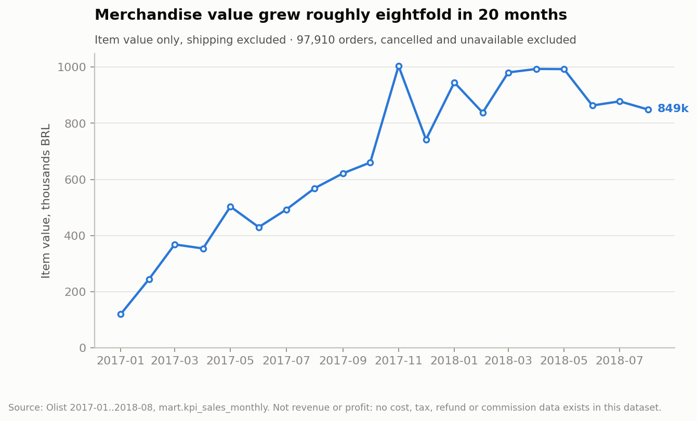
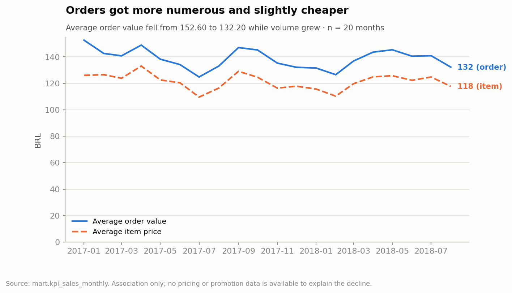
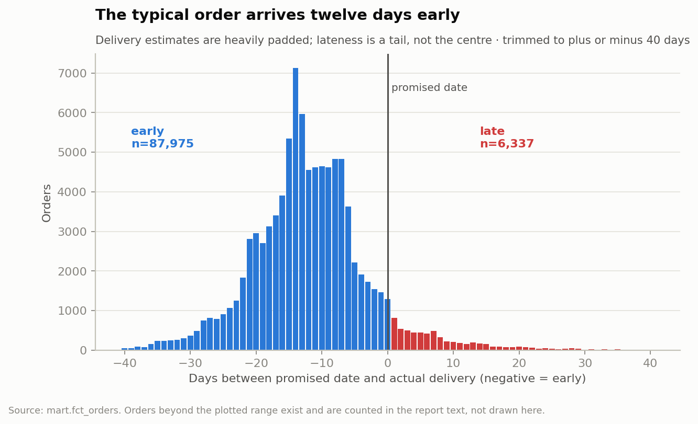
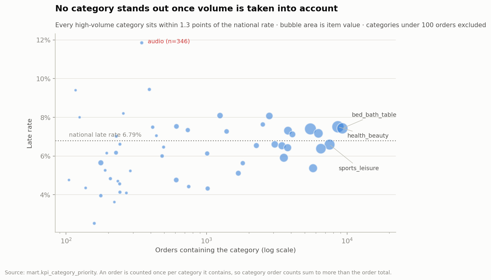
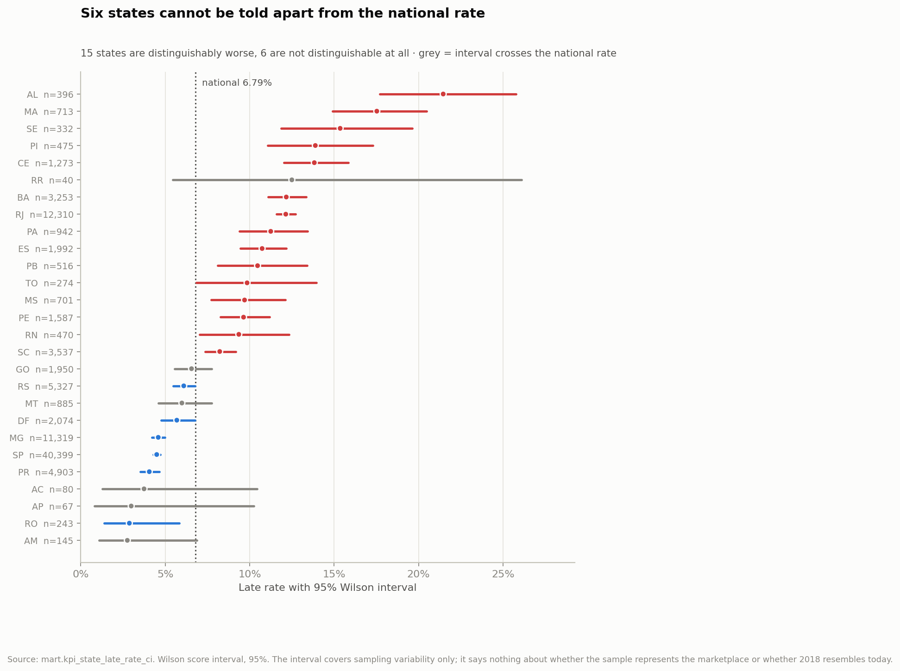
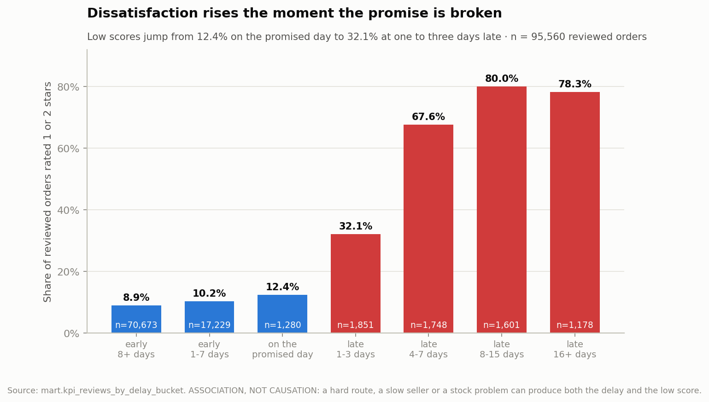
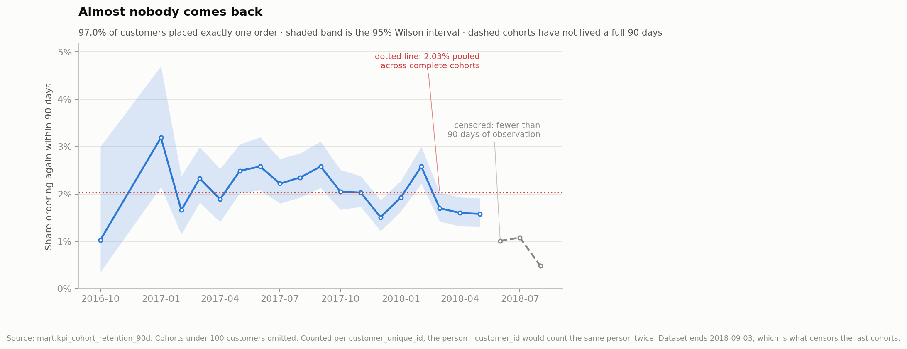

# Olist — sales, delivery performance and customer satisfaction

**Scope**: 99,441 orders placed on the Olist Brazilian marketplace. Analysis
window **2017-01 to 2018-08** (20 complete months, 97,910 sale-eligible orders).
Boundary months are excluded: 2016-09 holds 4 orders and 2016-12 holds exactly 1,
so including them would put a cliff at each end of every time series that is an
artefact of data coverage, not a business event.

**Every figure below was produced by a query executed against the local DuckDB
model.** The queries live in `sql/`, the aggregates in `dashboard/exports/`, and
117 tests in `tests/` assert that totals are conserved to the cent across all five
modelling layers — including `tests/test_report_figures.py`, which pins every
headline number quoted below, so this document fails a test rather than drifting
away from its data. Nothing here is transcribed from memory or from prior
knowledge of this dataset.

**Three things this report never claims**: that item value is revenue or profit
(there is no cost, tax, refund or commission data); that any relationship shown
is causal; or that a review of a multi-seller order belongs to one seller.

---

## Summary

1. Merchandise value grew roughly eightfold in 20 months, but **average order
   value fell 13%** and freight's share of item value rose from 14.0% to 17.5%.
   Growth is coming from more, smaller orders.
2. **6.79% of measurable deliveries arrived late** (6,531 of 96,203). The median
   order arrives **twelve days early** — estimates are heavily padded and
   lateness is a tail event, not a central tendency.
3. Lateness is **episodic, not structural**: three months out of twenty carry
   **48.4% of every late order**.
4. Where lateness is persistent, it is **geographic, not categorical**. Across
   categories with 1,000+ orders the late rate spans 4.32%–8.09%; across states
   it spans 2.8%–21.5%.
5. Review scores track lateness **monotonically** — but roughly **two thirds of
   1–2 star reviews sit on orders that arrived on time**, so delivery speed is
   not the whole satisfaction story.
6. Once sampling uncertainty is accounted for, **6 of 27 states cannot be
   distinguished from the national rate at all**, and 39 of 52 categories cannot
   either. Several headline gaps are too small to act on.
7. **97.0% of customers placed exactly one order.** The 90-day repeat rate is
   **2.03%**. This is an acquisition business, not a retention business, and that
   reframes what any delivery improvement is worth.

---

## Q1 — How does the value of sold items move over time?



| | 2017-01 | 2018-08 | change |
|---|---|---|---|
| Orders | 787 | 6,421 | ×8.2 |
| Item value (BRL) | 120,098 | 848,860 | ×7.1 |
| Average order value | 152.60 | 132.20 | **−13.4%** |
| Average item price | 126.02 | 117.64 | −6.6% |
| Freight as % of item value | 14.03% | 17.45% | **+3.4pp** |

Across the analysis window: item value **13,449,529.68 BRL**, freight
**2,234,177.06 BRL**, payments collected **15,687,157.17 BRL**. These are three
different measures and the report keeps them apart: payments exceed items plus
freight because of instalment charges and voucher mechanics, and none of the
three is profit.

*(The whole-dataset totals are larger — 13,591,643.70 / 2,251,909.54 /
16,008,872.12 — because they include cancelled orders and the sparse boundary
months. The two sets of numbers answer different questions and are not
interchangeable.)*



Order value fell faster than item price, which means baskets got smaller as well
as cheaper. The dataset contains no pricing, promotion, or catalogue-mix data, so
**why** this happened is not answerable here — it is a question for the
commercial team, flagged rather than guessed at.

## Q2 — Which categories and areas concentrate delays?

**Denominator first.** Of 99,441 orders, 96,478 reached `delivered` status, and
96,470 of those carry both a delivery timestamp and an estimate. The 8 orders
marked delivered with no delivery date are a data contradiction and are excluded
from every delay figure. Inside the analysis window the measurable population is
**96,203 orders**.

Lateness is measured at **date granularity**: `order_estimated_delivery_date`
carries no time component, so comparing it to a 09:00 delivery timestamp would
mark a same-day arrival as nine hours late. An order arriving on the promised
calendar day is on time.



| statistic | value |
|---|---|
| Late rate | **6.79%** (6,531 of 96,203) |
| Median delay | **−12 days** (early) |
| p90 delay | −2 days (still early) |
| p99 delay | +18 days |
| Maximum delay | +188 days |
| Median delivery time | 10 days |

### Lateness is episodic


| period | orders | late | late rate | share of all late orders |
|---|---|---|---|---|
| Nov 2017, Feb 2018, Mar 2018 | 20,846 | 3,158 | **15.15%** | **48.4%** |
| the other 17 months | 75,357 | 3,373 | 4.48% | 51.6% |

Three months out of twenty carry nearly half of all late orders. In those months
median delivery time stretched from 10 to 13 days and carrier handover from 2 to
3 days, while **the promised lead time did not move** (23 days vs 24). The
network absorbed more load without the promise adjusting to match.

Order volume correlates with the monthly late rate at **r = 0.51** — a moderate
association that does *not* account for the spikes. January 2018 carried 7,069
orders, comparable to November 2017's 7,288, at a 5.70% late rate against 12.40%.
Volume alone is not the explanation, and this dataset contains no capacity,
carrier, holiday-calendar or warehouse data that could supply one.

### By category — flat



| category | orders | late | late rate | gap vs national |
|---|---|---|---|---|
| bed_bath_table | 9,267 | 689 | 7.43% | +0.64pp |
| health_beauty | 8,610 | 647 | 7.51% | +0.72pp |
| baby | 2,800 | 226 | 8.07% | +1.28pp |
| audio | 346 | 41 | 11.85% | +5.06pp |

Among the 22 categories with at least 1,000 orders, late rates span **4.32% to
8.09%** — gaps of **−2.47pp to +1.30pp** against the national rate. The spread is
asymmetric: no category at volume is more than 1.3 points *worse* than national,
while the best (`luggage_accessories`, 1,019 orders, 4.32%) is 2.5 points better.
`audio` looks worse than any of them but rests on 346 orders, where a few dozen
events move the rate several points. **There is no category-level delay problem
in this data**, and the total spread at volume — 3.8 points — is smaller than the
gap between RJ and MG alone.

Counting rule: an order is counted once per category it contains, so category
order counts sum to more than the order total. This is correct for a
multi-category basket and is stated rather than avoided by forcing a single
category onto every order.

### Which of these gaps are real?

Showing group sizes is not the same as using them. AL's 21.46% rests on 396
orders and SP's 4.50% on 40,399; printing both to two decimals implies a
precision the smaller group does not have. Each rate below carries a **95% Wilson
score interval** — chosen over the normal approximation because the normal
interval misbehaves exactly here, at small n with proportions near zero, where it
can even return a negative lower bound.



| verdict against the national rate | states | orders |
|---|---|---|
| distinguishably worse | 15 | 28,771 |
| not distinguishable | 6 | 3,167 |
| distinguishably better | 6 | 64,265 |

**RR is the clearest lesson.** Its 12.50% point estimate would place it seventh
worst in the country — but on 40 orders the interval runs **5.46% to 26.11%**,
20.7 points wide, straddling the national rate. Ranking it alongside RJ would be
a mistake. RJ's own interval, on 12,310 orders, is 1.15 points wide.

For categories the intervals change a conclusion of mine. An earlier draft
dismissed `audio` as small-sample noise; the interval says otherwise —
**11.85% [8.86, 15.68]**, which clears the national rate. It is a real
difference. It is also 41 late orders in total, so it is real and negligible at
the same time, which is precisely the distinction a point estimate cannot make.

| verdict | categories | orders |
|---|---|---|
| distinguishably worse | 5 | 21,415 |
| not distinguishable | 39 | 59,433 |
| distinguishably better | 8 | 15,316 |

The five distinguishably worse categories are `audio` (+5.06pp, n=346),
`home_confort` (+2.65pp, n=392), `baby` (+1.28pp, n=2,800), `health_beauty`
(+0.72pp, n=8,610) and `bed_bath_table` (+0.64pp, n=9,267). Note what happens at
volume: the effects that survive are the ones too small to matter operationally,
while `office_furniture`, which has the largest gap of any category above 1,000
orders (+1.30pp), is **not** distinguishable. Statistically detectable and
operationally meaningful are different properties, and this dataset separates
them cleanly.

The intervals cover sampling variability only. They say nothing about whether
this anonymised sample represents the marketplace, or whether 2018 resembles
today.

### By destination state — not flat


| state | orders | late | late rate | excess late orders | median delivery | median promised | median handover |
|---|---|---|---|---|---|---|---|
| SP | 40,399 | 1,817 | 4.50% | −926 | 7 d | 19 d | 2 d |
| RJ | 12,310 | 1,495 | 12.14% | **+659** | 12 d | 25 d | 2 d |
| MG | 11,319 | 519 | 4.59% | −249 | 10 d | 24 d | 2 d |
| BA | 3,253 | 396 | 12.17% | +175 | 17 d | 30 d | 2 d |
| MA | 713 | 125 | 17.53% | +77 | 19 d | 31 d | 2 d |
| AL | 396 | 85 | **21.46%** | +58 | 22 d | 32 d | 3 d |

*`excess late orders` = late orders minus what the group would have at the
national rate. It is an arithmetic gap, not a forecast of what a fix would save.*

**RJ against MG is the cleanest comparison in the dataset**: similar volume
(12,310 vs 11,319), identical carrier handover (2 days), near-identical promised
lead time (25 vs 24 days) — and 12.14% late against 4.59%. Same promise, same
dispatch speed, very different outcome.

### The variance is downstream of handover

| | states ≥12% late | states <12% late |
|---|---|---|
| States | 8 | 19 |
| Orders | 18,792 | 77,411 |
| Median handover to carrier | 2.25 d | 2.18 d |
| Median total delivery | 18.38 d | 15.58 d |
| Median promised lead time | 31.88 d | 31.32 d |

Sellers dispatch at the same speed everywhere and promises are the same length
everywhere. The entire difference appears **after** the parcel leaves the seller.
That points at carrier network and final delivery, and away from seller dispatch
performance.

## Q3 — How do reviews differ between on-time and late orders?

Review coverage is **99.26%** (97,181 of 97,910 sale-eligible orders), so these
scores describe nearly the whole customer base rather than a self-selected
minority. Orders carrying more than one review (547) are collapsed to the most
recent; 202 of those had disagreeing scores, so the collapse rule genuinely moves
numbers and `score_spread` is retained in the model so the choice can be audited.

| outcome | orders | mean score | 1–2 ★ | 5 ★ | left a comment |
|---|---|---|---|---|---|
| on time | 89,182 | 4.291 | 9.25% | 62.27% | 39.18% |
| late | 6,378 | 2.271 | **62.40%** | 16.56% | 58.92% |



| bucket | orders | mean score | 1–2 ★ |
|---|---|---|---|
| early by 8+ days | 70,673 | 4.318 | 8.95% |
| early by 1–7 days | 17,229 | 4.201 | 10.23% |
| on the promised day | 1,280 | 4.034 | 12.42% |
| late 1–3 days | 1,851 | 3.291 | **32.14%** |
| late 4–7 days | 1,748 | 2.105 | 67.62% |
| late 8–15 days | 1,601 | 1.674 | 80.01% |
| late 16+ days | 1,178 | 1.727 | 78.27% |

Three observations, in decreasing order of confidence:

1. **The relationship is monotone across seven buckets.** A confounder would have
   to track lateness *by degree* to reproduce that, which makes the association
   considerably stronger than a two-group split would.
2. **The break is at the promise, not at an absolute speed.** Low scores go from
   12.42% on the promised day to 32.14% at one to three days late. What appears
   to matter is the promise being broken, not the number of days in transit.
3. **The curve plateaus past eight days** near 80%. Beyond a point, more lateness
   cannot lower a score that is already at the floor.

**This is an association, not a causal effect.** A difficult route, a slow
seller, or a stock problem can produce both the delay and the low score. Nothing
in this dataset isolates one from the other.

**And lateness is not the main source of dissatisfaction.** Of 12,228 orders
rated 1–2 stars in the window, **3,980 (32.5%) were late**. The other 8,248
arrived on time and were rated badly anyway. Even perfectly punctual orders carry
a 9.25% low-score rate — a floor that no logistics improvement can touch.

### An open question the data cannot settle

| | orders | reviewed | mean score | late rate |
|---|---|---|---|---|
| single-seller | 94,931 | 94,302 | 4.173 | 6.87% |
| multi-seller | 1,272 | 1,258 | **2.862** | **1.02%** |

Multi-seller orders are **six times less likely to be late** and score **1.3
stars worse**. Lateness cannot explain this. A plausible mechanism is split
shipments arriving at different times, so the customer experiences an incomplete
order even though the final parcel beat the promise — but `delivered_customer_at`
is a single order-level timestamp with no per-parcel dates, so **this cannot be
tested with the data available**. It is recorded as a question, not a finding.

## Q4 — What deserves attention, weighing rate against volume?

Ranking by rate alone promotes groups of a few hundred orders. Ranking by volume
alone promotes whatever is biggest. The table below carries both plus the
absolute count of late orders, which is the quantity an operations team actually
has to work through.

| rank by excess | state | orders | late rate | excess late orders |
|---|---|---|---|---|
| 1 | RJ | 12,310 | 12.14% | 659 |
| 2 | BA | 3,253 | 12.17% | 175 |
| 3 | CE | 1,273 | 13.83% | 90 |
| 4 | ES | 1,992 | 10.74% | 79 |
| 5 | MA | 713 | 17.53% | 77 |

Ranked by rate instead, AL (21.46%, 396 orders) and MA (17.53%, 713 orders) come
first and RJ falls to eighth — despite RJ alone accounting for more excess late
orders than the next four states combined.

**The top five states hold 20.3% of orders and 36.8% of all late orders.**

Item value associated with late orders: **985,618.47 BRL, 7.48% of item value in
the window.** That is the value of orders that happened to be late, not revenue
lost — no cancellation-after-delay or refund data exists to support a loss claim.

## Beyond the brief — repeat purchasing

The four questions above concern orders. This section concerns *people*, and it
is the reason `customer_unique_id` exists in the data model: there are 99,441
`customer_id` values but only 96,096 people behind them, so counting the wrong
one inflates the customer base by the repeat rate.



| orders per customer | customers | share of customers | share of orders | share of item value |
|---|---|---|---|---|
| 1 | 92,102 | **96.96%** | 93.78% | 94.44% |
| 2 | 2,652 | 2.79% | 5.40% | 4.82% |
| 3 | 188 | 0.20% | 0.57% | 0.50% |
| 4+ | 48 | 0.05% | 0.25% | 0.24% |

**97.0% of customers placed exactly one order.** Pooled across cohorts that have
lived a full 90 days, **2.03%** of new customers ordered again within 90 days
(1,560 of 76,845). The highest complete cohort reaches 3.19%; the lowest 1.03%.

**Right censoring is handled explicitly.** The last purchase in the dataset is
2018-09-03, so a customer who first bought in August 2018 had days to return
while one from January 2017 had eighteen months. Comparing them directly would
manufacture a decline that is purely an artefact of observation time. Every
cohort here is measured over the same fixed 90-day window, and the three cohorts
that have not lived through one are drawn dashed and flagged `is_complete =
false` rather than quietly shown or quietly dropped. Their apparent 1.01%, 1.08%
and 0.48% are censoring, not collapse.

**Why this reframes everything above.** At a 2% repeat rate, the marketplace runs
on acquisition, not retention. That cuts both ways for the delivery
recommendations: a customer who was going to buy once cannot be retained harder
by a faster delivery, so the case for fixing logistics rests on reputation,
review scores and marketplace standing rather than on a repeat-purchase model
this data does not support. It also means **no lifetime-value calculation is
available here** — with 97% single-purchase customers and a 20-month window,
there is no observed lifetime to value.

---

## Recommendations

Each names the evidence, what it would change, and how to tell whether it worked.

### 1. Make the delivery promise state-aware rather than uniform

**Evidence.** RJ and MG carry similar volume, identical 2-day carrier handover
and near-identical promised lead times (25 vs 24 days), yet RJ is late 12.14% of
the time against MG's 4.59%. Across the eight worst states, promises average
31.9 days against 31.3 elsewhere — essentially the same promise for materially
different routes. The eight states above 12% hold 18,792 orders.

**Action.** Set promised lead time per destination state (or per route band)
using that route's observed delivery distribution, rather than applying one
national padding rule.

**Measure.** Late rate per state, monthly, with n visible. Target: the eight
states above 12% converge toward the national rate. **Watch the trade-off** — a
longer promise reduces lateness by definition and may suppress conversion, so
track orders per state alongside the late rate, not instead of it.

### 2. Treat the three spike months as a capacity problem and instrument for it

**Evidence.** Nov 2017, Feb 2018 and Mar 2018 carry 48.4% of all late orders at a
15.15% rate against 4.48% in the other seventeen months. During those months
median delivery stretched 10 → 13 days and handover 2 → 3 days while the promise
stayed flat. Volume correlates at r = 0.51 — associated, but not sufficient:
Jan 2018 had comparable volume at a 5.70% rate.

**Action.** Two parts, and the second matters more. First, flex the promise
during known demand peaks instead of holding it fixed. Second, **capture the data
that would explain the spikes** — carrier assignment, dispatch capacity, per-parcel
tracking events. The current dataset can show *that* the spikes happened; it
cannot show why, and no amount of reanalysis will change that.

**Measure.** Late rate in peak months against the non-peak baseline of 4.48%.

### 3. Investigate multi-seller orders as a satisfaction problem in their own right

**Evidence.** 1,272 multi-seller orders: 1.02% late, mean score 2.862, against
6.87% late and 4.173 for single-seller orders. Better delivery performance,
substantially worse scores. This is the clearest signal in the data that
satisfaction is not reducible to punctuality — reinforced by the fact that 67.5%
of all 1–2 star reviews sit on orders that arrived on time.

**Action.** Record per-parcel delivery events so a split shipment can be
distinguished from a single one. Until then, this is an open question.

**Measure.** Mean review score for multi-seller orders, with n reported, once
per-parcel data exists. **Do not attribute these reviews to individual sellers**
— the review belongs to the order.

---

## Limits

**Structural**
- Data ends in **October 2018**. Nothing here describes current performance.
- **No cost, tax, refund, commission or cancellation-reason data.** Item value,
  freight and payments are three separate measures; none is profit, and no
  "revenue lost" figure can be derived.
- **No carrier, route, warehouse or per-parcel data.** The single biggest finding
  (48.4% of lateness in three months) cannot be explained, only observed.
- The dataset is **anonymised and sampled** by the publisher; it is not a
  complete census of the marketplace.

**Analytical**
- Every relationship reported is an **association**. No causal identification is
  attempted and none is available.
- Confidence intervals cover **sampling variability only**. They do not describe
  whether the anonymised sample represents the marketplace, and they are computed
  per group without correcting for the fact that 27 states and 52 categories are
  compared at once — a handful of "distinguishable" verdicts at the margin would
  be expected by chance alone. The verdicts are a filter against over-reading
  small groups, not a formal multiple-comparison procedure.
- Retention is measured on a **fixed 90-day window** per cohort. A different
  window would give a different rate; a 90-day figure is not a churn rate, and
  no lifetime value can be derived from 20 months of a 97%-single-purchase
  population.
- Delay is measured at **date granularity**; sub-day precision is not meaningful
  against a midnight estimate.
- Multiple reviews per order are collapsed to the **most recent** (547 orders,
  202 with disagreeing scores). A different rule would shift the review numbers.
- Category rates count an order **once per category it contains**, so category
  order counts sum to more than the order total.
- Several states and categories rest on **a few hundred orders**; their rates move
  several points on a handful of events. `n` is printed beside every rate for
  exactly this reason.

**Known data defects, carried rather than hidden**
| defect | rows | handling |
|---|---|---|
| Orders marked `delivered` with no delivery date | 8 | excluded from all delay KPIs |
| Delivery to customer earlier than handover to carrier | 23 | flagged; physically impossible |
| `review_id` reused across different orders | 789 | review grain is `(review_id, order_id)`, not `review_id` |
| Orders with no items (`unavailable`/`canceled`) | 775 | excluded from AOV denominator |
| Orders with no payment record | 1 | `bfbd0f9b…`, delivered, 3 items, Sept 2016 |
| Payment lines ≤ 0 | 9 | kept, never counted as revenue |
| Products with no category | 610 | bucketed as `unknown` |

These counts are frozen as baselines in `tests/test_grain.py`, so the suite fails
if the source data changes rather than staying permanently red.

---

## Reproducing every number in this report

```bash
python -m pip install -r requirements.txt
python src/ingest.py --download
python src/build.py
python -m pytest -q
python src/export_bi.py
python src/make_charts.py
```

Definitions for every KPI — formula, filter, denominator and caveat — are in
`dashboard/exports/kpi_definitions.csv` and `mart.kpi_definitions`.

Data: Olist Brazilian E-Commerce, CC BY-NC-SA 4.0. Only aggregates are
redistributed in this repository.
